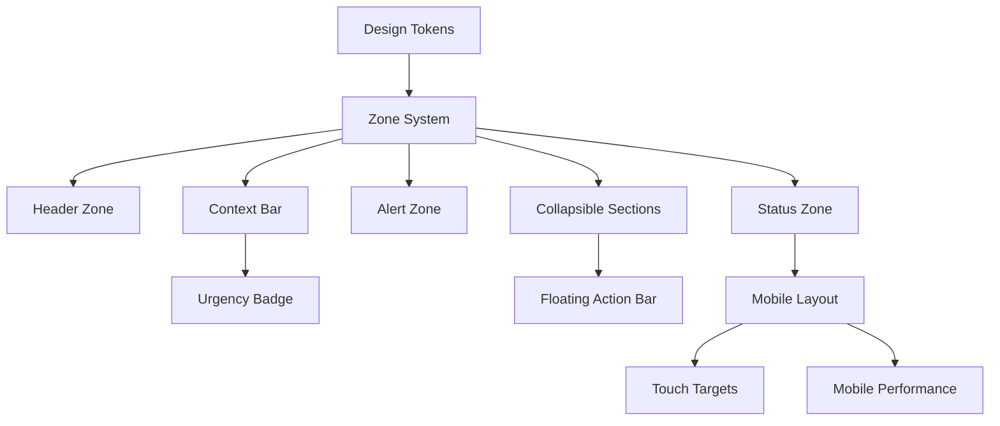

# Booking Detail Page Redesign - Implementation Plan

> **Project**: Booking Detail Redesign
> **Status**: Planning
> **Priority**: P0 - Critical
> **Estimated Effort**: 3 Cycles (6 sprints)

---

## Overview

Transform the booking detail page from a data-display page to an action-first, operator-optimized interface. The redesign follows a zone-based architecture prioritizing operator workflows.

### Success Metrics
- [ ] Time to complete primary action: < 2 seconds
- [ ] Time to find customer phone: < 1 second
- [ ] Time to identify balance due: < 0.5 seconds
- [ ] Special requirements visible without scroll: 100%
- [ ] Mobile usability score: 90+

---

## 🎯 Epic 1: Foundation & Cleanup

**Goal**: Fix critical bugs and establish design tokens before restructuring.

### BKD-101: Fix Status Badge Bug
**Type**: Bug | **Priority**: P0 | **Points**: 1

The header shows "COMPLETED" badge regardless of actual booking status.

**Tasks**:
- [ ] Remove hardcoded "COMPLETED" text from header
- [ ] Urgency badge should show time-based context (Today/Tomorrow/Soon), not status
- [ ] Status should only appear in the Status Card

**Acceptance Criteria**:
- Header badge shows urgency (Today/Tomorrow/In X days), not booking status
- No duplicate status displays on the page
- Status card is single source of truth for booking status

**Files**: `booking-header.tsx`

---

### BKD-102: Create Design Token System
**Type**: Enhancement | **Priority**: P0 | **Points**: 2

Establish consistent design tokens for the redesign.

**Tasks**:
- [ ] Create `booking-detail/tokens.ts` with typography scale
- [ ] Define spacing constants (zone gaps, card padding)
- [ ] Define color tokens for status states
- [ ] Define urgency color palette with dark mode variants

**Design Tokens**:
```typescript
// Typography Scale
const typography = {
  customerName: "text-2xl sm:text-3xl font-bold tracking-tight",
  sectionTitle: "text-sm font-semibold uppercase tracking-wide",
  label: "text-xs font-medium text-muted-foreground uppercase tracking-wider",
  value: "text-base font-semibold",
  detail: "text-sm text-muted-foreground",
  mono: "font-mono text-xs tabular-nums",
};

// Spacing
const spacing = {
  zoneGap: "space-y-4",           // Between major zones
  cardPadding: "p-4 sm:p-5",      // Inside cards
  sectionGap: "space-y-3",        // Between items in a section
};

// Status Colors
const statusColors = {
  confirmed: "text-emerald-600 dark:text-emerald-400",
  pending: "text-amber-600 dark:text-amber-400",
  cancelled: "text-red-600 dark:text-red-400",
  completed: "text-slate-600 dark:text-slate-400",
  no_show: "text-slate-500",
};

// Urgency Colors
const urgencyColors = {
  today: "bg-red-500 text-white",
  tomorrow: "bg-amber-500 text-white",
  soon: "bg-blue-500 text-white",
  past: "bg-slate-400 text-white",
};
```

**Acceptance Criteria**:
- All components import from central token file
- Dark mode works correctly for all tokens
- Typography is consistent across all zones

**Files**: `booking-detail/tokens.ts` (new)

---

### BKD-103: Remove Information Redundancy
**Type**: Enhancement | **Priority**: P1 | **Points**: 2

Eliminate duplicate information displays.

**Tasks**:
- [ ] Remove balance from Payment Details section (keep in Status Cards)
- [ ] Remove status badge from header (keep urgency badge only)
- [ ] Consolidate payment summary into single location
- [ ] Convert Payment Details to "Payment History" (expandable)

**Before → After**:
| Location | Before | After |
|----------|--------|-------|
| Header | Status badge + Urgency | Urgency only |
| Status Cards | Status + Balance | Status + Balance (primary) |
| Payment Details | Full breakdown + balance | History only (expandable) |

**Acceptance Criteria**:
- Balance shown exactly once (Status Cards)
- Status shown exactly once (Status Card)
- Payment history is collapsible
- No information loss, only reorganization

**Files**: `page.tsx`, `status-cards.tsx`, Payment Details section

---

### BKD-104: Compress Empty States
**Type**: Enhancement | **Priority**: P1 | **Points**: 2

Empty states currently waste prime screen real estate.

**Tasks**:
- [ ] Guide Assignment: "No guide" + [Assign] button on single line
- [ ] Activity: Single line "No activity" or hide section entirely
- [ ] Payments: "No payments" single line when $0 paid
- [ ] Participants: Collapse to summary when no special needs

**Current vs Proposed**:
```
CURRENT (Guide Assignment - 120px height):
┌────────────────────────────────────┐
│  GUIDE ASSIGNMENT        [Assign]  │
│                                    │
│         👤+                        │
│    No guide assigned               │
│                                    │
└────────────────────────────────────┘

PROPOSED (Guide Assignment - 48px height):
┌────────────────────────────────────┐
│  👤 No guide assigned    [Assign]  │
└────────────────────────────────────┘
```

**Acceptance Criteria**:
- Empty guide section: max 48px height
- Empty activity section: max 32px height or hidden
- Empty payments: single line
- Overall page height reduced by ~200px for empty booking

**Files**: `guest-summary-card.tsx`, Guide section, Activity section

---

## 🎯 Epic 2: Zone-Based Layout

**Goal**: Implement the new zone architecture for optimal information hierarchy.

### BKD-201: Implement Zone Container System
**Type**: Feature | **Priority**: P0 | **Points**: 3

Create the foundational zone layout structure.

**Tasks**:
- [ ] Create `BookingDetailLayout` component with 6 zones
- [ ] Implement fixed header zone (sticky on scroll)
- [ ] Implement context bar zone
- [ ] Implement conditional alert zone
- [ ] Implement status zone (twin cards)
- [ ] Implement scrollable content zone
- [ ] Implement floating action zone (mobile)

**Component Structure**:
```tsx
<BookingDetailLayout>
  <HeaderZone />      {/* Fixed, always visible */}
  <ContextBar />      {/* Tour + Date + Time + Urgency */}
  <AlertZone />       {/* Conditional: dietary/accessibility */}
  <StatusZone />      {/* Twin cards: status + balance */}
  <ContentZone>       {/* Scrollable */}
    <GuestsSection />
    <GuideSection />
    <PaymentsSection />
    <ActivitySection />
  </ContentZone>
  <ActionZone />      {/* Floating on mobile */}
</BookingDetailLayout>
```

**Acceptance Criteria**:
- Header stays visible on scroll (desktop)
- Floating action bar appears on mobile scroll
- Zones have correct spacing (16px gap)
- Layout is responsive (single column on mobile)

**Files**: `booking-detail/layout.tsx` (new), `page.tsx`

---

### BKD-202: Redesign Header Zone
**Type**: Feature | **Priority**: P0 | **Points**: 3

Customer-first header with instant recognition and primary action.

**Tasks**:
- [ ] Customer name: 28-32px, bold, tracking-tight
- [ ] Phone number: Prominent, tap-to-call, font-medium
- [ ] Email: Secondary, tap-to-email, text-muted
- [ ] Reference: Tiny, monospace, copy-on-click with feedback
- [ ] Primary action button: Large, colored based on action type
- [ ] Contact dropdown: Quick access to call/email/SMS
- [ ] Edit button: Icon-only, outline variant

**Visual Hierarchy**:
```
┌─────────────────────────────────────────────────────────────┐
│  ←  Test Customer                    [Confirm Booking]  📞 ✏️│
│      555-555-5555 • test@example.com                        │
│      BK-J7DAMH 📋                                           │
└─────────────────────────────────────────────────────────────┘
```

**Acceptance Criteria**:
- Customer name is largest text element on page
- Phone is clickable and prominent (font-medium)
- Email is clickable but secondary (text-muted)
- Reference shows copy icon on hover, checkmark on copy
- Primary action button is 1.5x larger than other buttons

**Files**: `booking-header.tsx`

---

### BKD-203: Implement Context Bar
**Type**: Feature | **Priority**: P0 | **Points**: 2

Horizontal strip showing tour context at a glance.

**Tasks**:
- [ ] Tour name with MapPin icon
- [ ] Date with Calendar icon
- [ ] Time with Clock icon
- [ ] Guest count with Users icon
- [ ] Urgency badge (TODAY/TOMORROW/SOON)
- [ ] "View customer profile" link (right-aligned)

**Component**:
```tsx
<ContextBar>
  <ContextItem icon={MapPin} label={tour.name} />
  <ContextItem icon={Calendar} label="Sat, Dec 27" />
  <ContextItem icon={Clock} label="6:30 PM" />
  <ContextItem icon={Users} label="3 guests" />
  <UrgencyBadge type="tomorrow" />
  <Link href={customerUrl}>View customer profile</Link>
</ContextBar>
```

**Acceptance Criteria**:
- All items on single line (desktop)
- Wraps gracefully on mobile
- Urgency badge is visually distinct
- Items have consistent icon + text alignment

**Files**: `booking-detail/context-bar.tsx` (new)

---

### BKD-204: Implement Urgency Badge System
**Type**: Feature | **Priority**: P1 | **Points**: 2

Time-based urgency indicators with appropriate visual treatment.

**Tasks**:
- [ ] TODAY: Red background, subtle pulse animation
- [ ] TOMORROW: Amber background, static
- [ ] SOON (2-3 days): Blue background, static
- [ ] PAST: Slate background, static
- [ ] NORMAL (4+ days): No badge shown

**Animation (TODAY only)**:
```css
@keyframes urgency-pulse {
  0%, 100% { opacity: 1; }
  50% { opacity: 0.7; }
}
.urgency-today {
  animation: urgency-pulse 2s ease-in-out infinite;
}
```

**Acceptance Criteria**:
- Pulse animation is subtle (2s duration, 0.7 minimum opacity)
- Colors work in dark mode
- Badge is compact (max 80px width)
- Shows appropriate icon (Clock, AlertCircle, etc.)

**Files**: `booking-detail/urgency-badge.tsx` (new)

---

### BKD-205: Redesign Alert Zone
**Type**: Feature | **Priority**: P0 | **Points**: 3

Operations alert bar that's impossible to miss.

**Tasks**:
- [ ] Only render if dietary/accessibility/special requests exist
- [ ] High-contrast amber background
- [ ] Expandable to show full details
- [ ] Show count badges for each category
- [ ] Auto-expand if critical (accessibility needs)

**Component**:
```tsx
<AlertZone>
  ⚠️ Operations Alert
  • Dietary: Vegetarian, Gluten-free (2)
  • Accessibility: Wheelchair required (1)
  [Expand for details]
</AlertZone>
```

**Acceptance Criteria**:
- Alert is above the fold, always visible
- Cannot be scrolled past without seeing it
- Click to expand shows full participant details with needs
- Alert has sufficient contrast (WCAG AA)

**Files**: `operations-alert-bar.tsx`

---

### BKD-206: Redesign Status Zone
**Type**: Feature | **Priority**: P0 | **Points**: 2

Twin status cards with clear visual hierarchy.

**Tasks**:
- [ ] Status card: Booking status with colored icon
- [ ] Balance card: Amount due with progress bar and collect action
- [ ] Cards have equal width, slight visual distinction
- [ ] Balance card emphasizes amount when due > 0

**Visual Treatment**:
```
┌──────────────────────┐  ┌──────────────────────────────────┐
│  STATUS              │  │  BALANCE                         │
│  ✓ Confirmed         │  │  $222.50          [💳 Collect]   │
│  (emerald text)      │  │  ████████░░░░ 0% paid            │
└──────────────────────┘  └──────────────────────────────────┘
```

**Acceptance Criteria**:
- Cards are side-by-side on desktop, stacked on mobile
- Status icon color matches status (emerald/amber/red/slate)
- Balance amount is 2xl when > 0, xl when paid
- Progress bar shows paid percentage
- Collect button only shows when balance > 0

**Files**: `status-cards.tsx`

---

### BKD-207: Implement Collapsible Content Sections
**Type**: Feature | **Priority**: P1 | **Points**: 5

Collapsible sections for guests, guide, payments, activity.

**Tasks**:
- [ ] Create `CollapsibleSection` base component
- [ ] Implement smooth expand/collapse animation (300ms)
- [ ] Show summary in collapsed state
- [ ] Visual indicator for "has important content"
- [ ] Auto-expand sections with special needs

**Sections**:
| Section | Collapsed Summary | Auto-Expand When |
|---------|-------------------|------------------|
| Guests | "3 total • 2 Adults • 1 Child" | Has dietary/accessibility |
| Guide | "John D. - Confirmed" or "No guide" | Never |
| Payments | "$150 of $222 paid" or "No payments" | Never |
| Activity | "Last: Booking created Dec 27" | Never |

**Acceptance Criteria**:
- Animation is smooth (ease-out, 300ms)
- Collapsed state shows most critical info
- Sections with special needs have visual flag
- Expansion state persists during session

**Files**: `booking-detail/collapsible-section.tsx` (new), Content zone components

---

### BKD-208: Implement Floating Action Bar
**Type**: Feature | **Priority**: P1 | **Points**: 3

Sticky bottom bar for mobile with key actions.

**Tasks**:
- [ ] Appears when header scrolls out of view
- [ ] Shows: Customer name, Balance, Primary action, Contact
- [ ] Blur backdrop, elevated shadow
- [ ] Safe area padding for iOS

**Component**:
```tsx
<FloatingActionBar visible={!headerInView}>
  <div>
    <p className="font-semibold">{customerName}</p>
    <p className="text-amber-600">${balance} due</p>
  </div>
  <div className="flex gap-2">
    <Button onClick={collectPayment}>Collect</Button>
    <Button onClick={primaryAction}>{actionLabel}</Button>
    <Button variant="outline" onClick={contact}>📞</Button>
  </div>
</FloatingActionBar>
```

**Acceptance Criteria**:
- Appears smoothly when header leaves viewport
- Has backdrop blur for readability
- Touch targets are minimum 44px
- Works correctly on iOS (safe area inset)
- Disappears when scrolling back to top

**Files**: `floating-action-bar.tsx`

---

## 🎯 Epic 3: Mobile Optimization

**Goal**: Ensure the page works perfectly on mobile devices.

### BKD-301: Mobile Layout Restructure
**Type**: Feature | **Priority**: P1 | **Points**: 3

**Tasks**:
- [ ] Single-column layout on mobile (< 768px)
- [ ] Stack status cards vertically
- [ ] Full-width collapsible sections
- [ ] Floating action bar always visible
- [ ] Context bar wraps to 2 lines if needed

**Acceptance Criteria**:
- All content visible without horizontal scroll
- Touch targets minimum 44px
- Floating bar has correct safe area padding
- Performance: FCP < 2s on 3G

**Files**: All components (responsive classes)

---

### BKD-302: Touch Target Optimization
**Type**: Enhancement | **Priority**: P1 | **Points**: 2

**Tasks**:
- [ ] Audit all buttons for minimum 44px touch target
- [ ] Increase tap area on phone number and email links
- [ ] Make reference number copy area larger
- [ ] Ensure dropdown menus have adequate spacing

**Acceptance Criteria**:
- All interactive elements: minimum 44x44px touch area
- Links have adequate padding
- No touch target overlap

---

### BKD-303: Mobile Performance Optimization
**Type**: Enhancement | **Priority**: P2 | **Points**: 2

**Tasks**:
- [ ] Lazy load activity section content
- [ ] Optimize image loading for guide avatars
- [ ] Reduce initial bundle size
- [ ] Add loading skeletons for async content

**Acceptance Criteria**:
- Lighthouse mobile score: 90+
- FCP: < 2 seconds on 3G
- TTI: < 3 seconds on 3G

---

## 🎯 Epic 4: Interactions & Polish

**Goal**: Add micro-interactions and polish for a premium feel.

### BKD-401: Implement Keyboard Shortcuts
**Type**: Feature | **Priority**: P2 | **Points**: 2

**Tasks**:
- [ ] `P` - Open payment modal
- [ ] `E` - Navigate to edit
- [ ] `C` - Open contact menu
- [ ] `G` - Open guide assignment
- [ ] `Esc` - Go back
- [ ] Show shortcut hints in action zone

**Acceptance Criteria**:
- Shortcuts work when not in input field
- Visual feedback when shortcut is triggered
- Shortcuts are discoverable (shown in UI)
- Only show on desktop (hidden on mobile)

---

### BKD-402: Add Micro-Animations
**Type**: Enhancement | **Priority**: P2 | **Points**: 2

**Tasks**:
- [ ] Copy reference number: checkmark fade in/out
- [ ] Status change: subtle color transition
- [ ] Balance update: number count animation
- [ ] Section expand: smooth height transition
- [ ] Button hover: subtle scale (1.02)

**Acceptance Criteria**:
- Animations are subtle and fast (< 300ms)
- No animation causes layout shift
- Reduced motion preference is respected

---

### BKD-403: Loading States & Skeletons
**Type**: Enhancement | **Priority**: P2 | **Points**: 2

**Tasks**:
- [ ] Page loading skeleton
- [ ] Section loading states
- [ ] Button loading spinners
- [ ] Optimistic updates for mutations

**Acceptance Criteria**:
- Skeleton matches final layout dimensions
- Loading states prevent double-clicks
- Optimistic updates feel instant

---

## 🎯 Epic 5: Testing & Documentation

### BKD-501: Unit Tests
**Type**: Testing | **Priority**: P1 | **Points**: 3

**Tasks**:
- [ ] Test urgency badge calculations
- [ ] Test collapsible section behavior
- [ ] Test status color mapping
- [ ] Test balance formatting

---

### BKD-502: E2E Tests
**Type**: Testing | **Priority**: P1 | **Points**: 3

**Tasks**:
- [ ] Test complete booking workflow
- [ ] Test payment collection flow
- [ ] Test mobile floating bar behavior
- [ ] Test keyboard shortcuts

---

### BKD-503: Update Component Documentation
**Type**: Documentation | **Priority**: P2 | **Points**: 1

**Tasks**:
- [ ] Document zone architecture
- [ ] Document design tokens
- [ ] Add usage examples for new components
- [ ] Update CLAUDE.md with new patterns

---

## Implementation Schedule

### Cycle 1 (Sprint 1-2): Foundation
| ID | Task | Points | Sprint |
|----|------|--------|--------|
| BKD-101 | Fix Status Badge Bug | 1 | 1 |
| BKD-102 | Create Design Token System | 2 | 1 |
| BKD-103 | Remove Information Redundancy | 2 | 1 |
| BKD-104 | Compress Empty States | 2 | 2 |
| BKD-201 | Zone Container System | 3 | 2 |

### Cycle 2 (Sprint 3-4): Core Features
| ID | Task | Points | Sprint |
|----|------|--------|--------|
| BKD-202 | Redesign Header Zone | 3 | 3 |
| BKD-203 | Implement Context Bar | 2 | 3 |
| BKD-204 | Urgency Badge System | 2 | 3 |
| BKD-205 | Redesign Alert Zone | 3 | 4 |
| BKD-206 | Redesign Status Zone | 2 | 4 |
| BKD-207 | Collapsible Content Sections | 5 | 4 |

### Cycle 3 (Sprint 5-6): Mobile & Polish
| ID | Task | Points | Sprint |
|----|------|--------|--------|
| BKD-208 | Floating Action Bar | 3 | 5 |
| BKD-301 | Mobile Layout Restructure | 3 | 5 |
| BKD-302 | Touch Target Optimization | 2 | 5 |
| BKD-303 | Mobile Performance | 2 | 5 |
| BKD-401 | Keyboard Shortcuts | 2 | 6 |
| BKD-402 | Micro-Animations | 2 | 6 |
| BKD-403 | Loading States | 2 | 6 |
| BKD-501-503 | Testing & Docs | 7 | 6 |

---

## Dependencies



---

## Risk Assessment

| Risk | Impact | Mitigation |
|------|--------|------------|
| Breaking existing functionality | High | Comprehensive test coverage |
| Performance regression | Medium | Lighthouse benchmarks before/after |
| Mobile usability issues | High | Test on real devices |
| Accessibility regression | Medium | WCAG audit before launch |

---

## Definition of Done

Each task is complete when:
- [ ] Code passes TypeScript strict mode
- [ ] Component is responsive (mobile + desktop)
- [ ] Dark mode works correctly
- [ ] Loading states are implemented
- [ ] Error states are handled
- [ ] Accessibility: keyboard navigable, screen reader friendly
- [ ] Unit tests pass
- [ ] Visual review approved

---

*Last updated: December 28, 2025*
