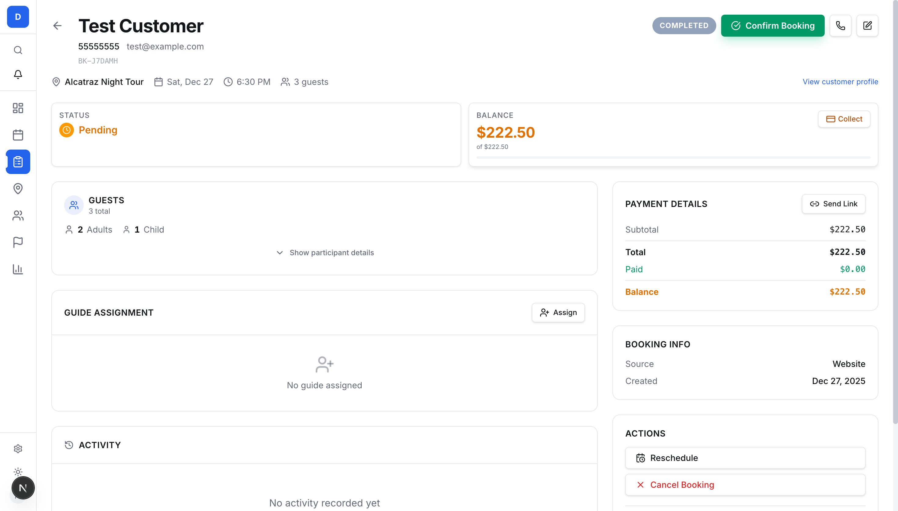

# Booking Detail Page - First Principles Review

## Executive Summary

The current booking detail page contains all necessary information but lacks **cohesion**, **elegance**, and **operational clarity**. This document analyzes the page from first principles, identifies critical issues, and proposes a world-class redesign.

**Core Problem**: The page is designed around *data categories* rather than *operator workflows*.

---

## Part 1: First Principles Analysis

### The Operator's Mental Model

When a tour operator opens a booking, they have one of these intents:

| Intent | Frequency | Time Pressure |
|--------|-----------|---------------|
| **Take Action** (confirm, cancel, collect payment) | 60% | High |
| **Answer a Question** (from customer calling) | 25% | Immediate |
| **Prepare for Tour** (check dietary needs, guest counts) | 10% | Medium |
| **Audit/Review** (historical lookup) | 5% | Low |

The page should optimize for the **60% case** while enabling quick access to all others.

### Information Priority Hierarchy

**Tier 1 - Instant Recognition (< 0.5 seconds)**
1. WHO is this booking for? → Customer Name
2. WHAT needs to happen? → Primary Action (Confirm/Collect/Complete)
3. HOW MUCH is owed? → Balance Due

**Tier 2 - Operational Context (1-2 seconds)**
4. WHEN is the tour? → Date/Time + Urgency
5. WHAT tour? → Tour Name
6. ANY special requirements? → Dietary/Accessibility Alerts

**Tier 3 - Supporting Details (On Demand)**
7. Guest breakdown
8. Payment history
9. Activity log
10. Guide assignment

---

## Part 2: Current Page Problems

### Screenshot Analysis



### Critical Issues Identified

#### 1. Visual Hierarchy Failure
| Problem | Impact |
|---------|--------|
| "COMPLETED" badge shows incorrect status (says "Completed" but status is "Pending") | Confusion, potential operational errors |
| Status and Balance cards have equal visual weight | No clear priority |
| Primary action (Confirm Booking) competes with secondary elements | Slows workflow |
| Too many cards with similar styling | Visual fatigue |

#### 2. Information Architecture Issues
| Problem | Impact |
|---------|--------|
| Balance shown twice (Status cards + Payment Details) | Redundancy, visual clutter |
| Payment Details section repeats information already visible | Wasted space |
| Guide Assignment takes large space for empty state | Poor use of real estate |
| Activity section dominates with "No activity" message | Empty states are too prominent |

#### 3. Workflow Friction
| Problem | Impact |
|---------|--------|
| Actions buried in right sidebar, requires scrolling | Extra time to complete tasks |
| No dietary/accessibility alerts visible | Critical info could be missed |
| Keyboard shortcuts hidden in small text | Discoverable only by accident |
| Contact info not immediately clickable-obvious | Slows customer callbacks |

#### 4. Layout Structure Issues
| Problem | Impact |
|---------|--------|
| 3-column grid creates horizontal eye movement | Harder to scan |
| Empty states occupy prime real estate | Wastes valuable screen space |
| No visual grouping of related actions | Cognitive overhead |
| Right sidebar feels like an afterthought | Inconsistent information architecture |

---

## Part 3: World-Class Design Principles

Based on research into leading dashboard and booking system designs:

### Principle 1: Action-First Architecture
> "The best dashboards show no more than 5-6 cards in their initial view" - [Pencil & Paper](https://www.pencilandpaper.io/articles/ux-pattern-analysis-data-dashboards)

**Application**: Reduce visible sections from 8+ to maximum 4 primary areas.

### Principle 2: Top-Down Information Flow
> "Present the most important metrics at the top, supporting context in the middle, and detailed breakdowns at the bottom" - [UXPin](https://www.uxpin.com/studio/blog/dashboard-design-principles/)

**Application**:
- Top: Customer + Primary Action + Balance
- Middle: Tour Context + Alerts
- Bottom: Expandable details (guests, payments, activity)

### Principle 3: Workflow Integration
> "Try a workflow mapping exercise with your users... this guides what to actually show" - [Adam Fard Studio](https://adamfard.com/blog/dashboard-ui)

**Application**: Design around the 4 operator intents identified above.

### Principle 4: Mobile-First & Fast
> "60%+ bookings are made on mobile... loading under 5 seconds is essential" - [PHP Travels](https://phptravels.com/blog/hotel-reservation-system-design)

**Application**: Critical actions must be thumb-reachable, information must be scannable.

### Principle 5: Eliminate Redundancy
> "A trip management dashboard reduces the need for manual spreadsheets and email chains" - [WeTravel Academy](https://academy.wetravel.com/tour-booking-software-top-features)

**Application**: Show each piece of information exactly once, in the right context.

---

## Part 4: Proposed Redesign

### New Visual Hierarchy

```
┌────────────────────────────────────────────────────────────────┐
│  HEADER ZONE (Fixed, Always Visible)                          │
│  ┌──────────────────────────────────────────────────────────┐ │
│  │  ← Back   CUSTOMER NAME (XXL)           [Primary Action] │ │
│  │           Phone • Email                 [Contact] [Edit] │ │
│  │           BK-XXXXXX                                       │ │
│  └──────────────────────────────────────────────────────────┘ │
├────────────────────────────────────────────────────────────────┤
│  CONTEXT BAR (Tour + Time + Urgency Badge)                    │
│  [Tour Name]  [Date]  [Time]  [Guests]  [URGENCY BADGE]       │
├────────────────────────────────────────────────────────────────┤
│  ALERT ZONE (Only if special requirements exist)              │
│  ⚠️ Operations Alert: Dietary (2) • Accessibility (1)         │
├────────────────────────────────────────────────────────────────┤
│  STATUS ZONE (Twin Cards - Most Critical Metrics)             │
│  ┌─────────────────────┐  ┌─────────────────────────────────┐ │
│  │  STATUS             │  │  BALANCE DUE                    │ │
│  │  ✓ Confirmed        │  │  $222.50        [Collect]       │ │
│  │                     │  │  ████████░░ 0% paid             │ │
│  └─────────────────────┘  └─────────────────────────────────┘ │
├────────────────────────────────────────────────────────────────┤
│  CONTENT ZONE (Scrollable, Tabbed or Collapsible)             │
│  ┌──────────────────────────────────────────────────────────┐ │
│  │  GUESTS (Collapsible)                                    │ │
│  │  3 total • 2 Adults • 1 Child   [⚠️ 1 special need]      │ │
│  │  └─ Expanded: participant details with dietary/access    │ │
│  ├──────────────────────────────────────────────────────────┤ │
│  │  GUIDE (Compact)              │  PAYMENTS (Compact)      │ │
│  │  [Avatar] John D. - Confirmed │  $0.00 of $222.50 paid   │ │
│  │  OR: [Assign Guide]           │  [View History]          │ │
│  ├──────────────────────────────────────────────────────────┤ │
│  │  ACTIVITY (Collapsible, starts collapsed)                │ │
│  │  Latest: Created Dec 27      [Show All Activity]         │ │
│  └──────────────────────────────────────────────────────────┘ │
├────────────────────────────────────────────────────────────────┤
│  ACTION ZONE (Always visible, bottom of viewport)             │
│  [Reschedule]  [Cancel]  |  Shortcuts: P E Esc                │
└────────────────────────────────────────────────────────────────┘
```

### Zone Breakdown

#### Zone 1: Header (Fixed)
**Purpose**: Instant customer identification + primary action
- Customer name: 28-32px, bold, dark
- Contact info: 14px, clickable (phone: bold, email: muted)
- Reference: 12px, monospace, copy-on-click
- Primary action: Large, colored button (Confirm=green, Collect=amber)

#### Zone 2: Context Bar (Fixed)
**Purpose**: Tour context at a glance
- Horizontal strip with tour name, date, time, guest count
- Urgency badge: TODAY (red pulse), TOMORROW (amber), SOON (blue)

#### Zone 3: Alert Zone (Conditional)
**Purpose**: Impossible-to-miss operational warnings
- Only renders if dietary/accessibility/special requests exist
- High-contrast amber background, icon + text
- Expandable to show full details

#### Zone 4: Status Zone (Fixed)
**Purpose**: The two most critical metrics
- Booking status with colored icon
- Balance due with progress bar and collect action
- Equal width, clear visual distinction

#### Zone 5: Content Zone (Scrollable)
**Purpose**: Supporting details, organized by frequency of use
- Guests: Collapsed by default unless special needs exist
- Guide: Compact, shows assigned or assign CTA
- Payments: Summary line, expandable history
- Activity: Collapsed by default, shows latest only

#### Zone 6: Action Zone (Fixed/Floating)
**Purpose**: Secondary actions always accessible
- Reschedule, Cancel, No-Show buttons
- Keyboard shortcut hints
- Appears as floating bar on scroll (mobile)

---

## Part 5: Specific Improvements

### Improvement 1: Remove Redundancy
| Current | Proposed |
|---------|----------|
| Balance in Status Cards | Keep |
| Balance in Payment Details | Remove (keep "View History" link) |
| Status in header badge | Remove (use only Status Card) |
| Full payment breakdown | Collapse into expandable |

### Improvement 2: Compress Empty States
| Current | Proposed |
|---------|----------|
| Large "No guide assigned" with icon | Single line: "No guide" + [Assign] button |
| Large "No activity yet" section | Single line: "No activity" (or hide entirely) |
| Expanded payment section when $0 paid | Collapsed: "No payments yet" |

### Improvement 3: Elevate Critical Info
| Current | Proposed |
|---------|----------|
| Dietary requirements: Hidden in participant expansion | Alert bar at top, always visible |
| Urgency: Small badge in header | Large, pulsing badge near date |
| Primary action: Same size as secondary | 1.5x larger, prominent color |

### Improvement 4: Fix Visual Consistency
| Issue | Fix |
|-------|-----|
| Inconsistent card border radius | Standardize to 12px (rounded-xl) |
| Mixed spacing | 16px (p-4) for cards, 24px (space-6) between sections |
| Typography hierarchy unclear | Use 4 sizes: XL (title), LG (section), MD (label), SM (detail) |

### Improvement 5: Mobile Optimization
| Current | Proposed |
|---------|----------|
| 3-column layout doesn't work on mobile | Single column, stacked cards |
| Buttons require precision tap | Minimum 44px touch targets |
| Floating bar hidden | Floating bar always visible at bottom |
| Keyboard shortcuts useless on mobile | Show only on desktop |

---

## Part 6: Implementation Priority

### Phase 1: Critical Fixes (Immediate)
1. Fix the status badge showing wrong status
2. Remove duplicate balance display
3. Make alert bar always visible when there are special requirements
4. Compress empty states

### Phase 2: Layout Restructure (Short-term)
1. Implement zone-based layout
2. Add urgency badge system
3. Create collapsible content sections
4. Fix mobile responsiveness

### Phase 3: Polish (Medium-term)
1. Add subtle animations for state changes
2. Implement keyboard navigation
3. Add command palette integration
4. Performance optimization

---

## Part 7: Success Metrics

After implementation, measure:

| Metric | Target |
|--------|--------|
| Time to complete primary action | < 2 seconds |
| Time to find customer phone | < 1 second |
| Time to identify balance due | < 0.5 seconds |
| Time to see special requirements | Instant (visible without scroll) |
| Mobile usability score | 90+ (Google Lighthouse) |

---

## Conclusion

The current page is **functional but not elegant**. It presents data without considering operator workflows. The redesign should:

1. **Ruthlessly prioritize** - Not all information is equal
2. **Eliminate redundancy** - Show each fact once
3. **Compress empty states** - Don't waste space on "nothing here"
4. **Elevate critical info** - Special requirements, balance due
5. **Action-first design** - The operator is here to DO something

The goal is a page that feels like a **surgical instrument** - every element has purpose, nothing is wasted, and the operator can complete their task with minimal friction.

---

## Sources

- [Pencil & Paper - Dashboard Design UX Patterns](https://www.pencilandpaper.io/articles/ux-pattern-analysis-data-dashboards)
- [UXPin - Dashboard Design Principles for 2025](https://www.uxpin.com/studio/blog/dashboard-design-principles/)
- [Adam Fard Studio - Dashboard UI Best Practices](https://adamfard.com/blog/dashboard-ui)
- [Justinmind - Dashboard Design Best Practices](https://www.justinmind.com/ui-design/dashboard-design-best-practices-ux)
- [WeTravel Academy - Tour Booking Software Features](https://academy.wetravel.com/tour-booking-software-top-features)
- [PHP Travels - Hotel Reservation System Design](https://phptravels.com/blog/hotel-reservation-system-design)
